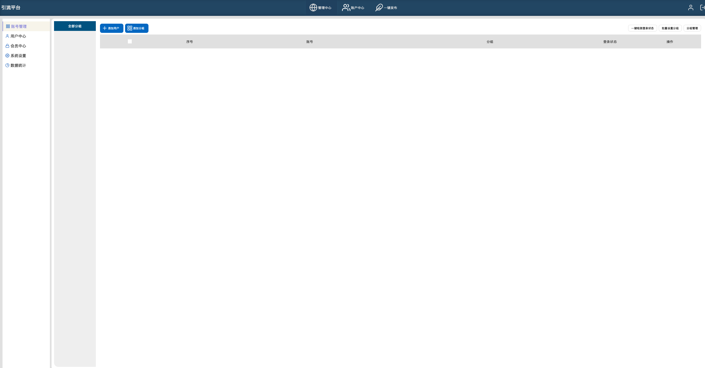

# 仿蚁小二的自动化工具

## 界面

## 支持类型

|            | 图文 | 横视频 | 竖视频 | 短文 |
| ---------- | ---- | ------ | ------ | ---- |
| 小红书     | ✅   | ✅     | ❌     | ❌   |
| 西瓜视频   | ❌   | ✅     | ❌     | ❌   |
| 知乎       | ✅   | ✅     | ❌     | ❓   |
| 微信公众号 | ✅   | ❌     | ❌     | ❌   |
| B 站       | ✅   | ✅     | ❌     | ❌   |
| 头条       | ✅   | ✅     | ❌     | ❓   |
| 抖音       | ✅   | ❓     | ✅     | ❌   |
| 快手       | ✅   | ✅     | ❌     | ❌   |
| 腾讯微视   | ❌   | ✅     | ❌     | ❌   |

## 说明

### 西瓜视频

- **标题** 5-30
- 标签 10
- **封面**
- 简介 0-400
- 公开 粉丝可见 仅我可见

### 小红书

#### 图文

- 图片 1-18
- 标题 0-20
- 正文 0-1000
- 标签 #
- 公开 仅我可见

#### 视频

- 标题 0-20
- 正文 0-1000
- 标签 #
- 公开 仅我可见

### 知乎

#### 图文

- 标题 0-100
- 正文 导入 docx
- 封面

#### 视频

- **标题** 0-40
- 封面
- 简介 0-300
- **所属领域** 2 个
- **绑定话题** >=1
- **视频类型** 原创 转载
- 定时发布

### 头条

#### 视频（西瓜）

#### 图文

- 标题 2-30
- 正文 导入 docx
- **封面** 单图 三图
- 添加位置 城市
- **投放广告**
- 声明首发

### 抖音

#### 视频 < 40s

- 主题 0-30
- 简介 0-1000
- 话题 #
- 封面
- 公开 仅我可见

#### 图文

- 主题 0-30
- 简介 0-1000
- 话题 #
- 封面
- 公开 仅我可见

### 快手

#### 视频 < 40s

- 简介 0-1000
- 话题 #
- 封面
- 公开 好友可见 仅我可见

#### 图文

- 简介 0-1000
- 话题 #
- 封面
- 公开 好友可见 仅我可见

### 微视视频

#### 视频 mp4/webm

- 简介 0-200
- 话题 #
- 公开 仅我可见

## TODO

- [ ] improve Readme
- [ ] add release CI for windows
- [ ] refactor code about check account active or not
